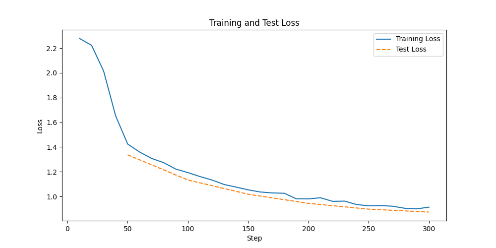
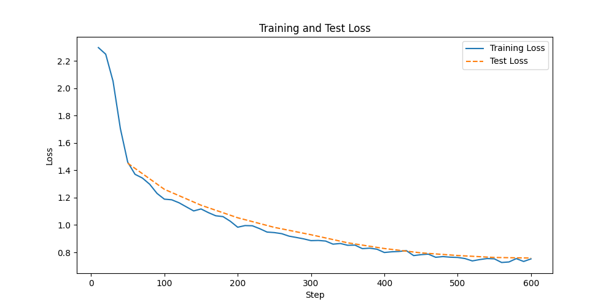

# RAG&NLI BenchMark 项目文档

## 项目链接

GitHub链接：https://github.com/ldbb/RAG_NLIBench.git

## 简述

RAG能够简化大模型的推理和决策过程，提高自主性。通过直接检索相关信息，RAG可以简化模型内部构建推理链的过程，减少推理步骤，使决策过程更加高效和直接。但是在什么情况下简化了模型推理和决策过程没有明确的metric。

## Contribution（待补充完善）

- 提出metric，RAG如何简化推理

## 方法

### LlaMa2-7b fine-tune

- Instruction-tuning Dataset

  1. 数据来源 

  | 数据集/项目名称                         | 任务 | 语言 | 数据集链接                                                   |
  | --------------------------------------- | ---- | ---- | ------------------------------------------------------------ |
  | Super-Natural Instruction               | 76   | 55   | https://allenai.org/data/natural-instructions                |
  | GPT-4-LLM（无划分）                     | -    | En   | https://github.com/Instruction-Tuning-with-GPT-4/GPT-4-LLM   |
  | Unnatural Instruction（无任务种类划分） | -    | En   | https://github.com/orhonovich/unnatural-instructions         |
  | Self-Instruct（无任务种类划分）         | -    | En   | https://github.com/yizhongw/self-instruct                    |
  | Dolly（按InstructGPT种类划分）          | 8    | En   | https://huggingface.co/datasets/databricks/databricks-dolly-15k/tree/main |
  | Alpaca（无划分）                        | -    | En   | https://github.com/tatsu-lab/stanford_alpaca                 |

  2. 分类：训练一个MLP，把Super Natural Instruction数据集中的1612条definition和category当作训练集进行训练，acc：0.82，并对其它数据集进行分类。

  3. 任务种类：根据Super Natural Instruction，共76类。

  4. 训练数据筛选：1600+任务中每个选取前40条，并去除token>256的数据，保证训练数据的完整性，最终有61250条训练数据。任务种类分布如下：

     | Category                            | Count |
     | ----------------------------------- | ----- |
     | Answer Verification                 | 209   |
     | Answerability Classification        | 560   |
     | Cause Effect Classification         | 1480  |
     | Code to Text                        | 83    |
     | Coherence Classification            | 240   |
     | Commonsense Classification          | 960   |
     | Coreference Resolution              | 534   |
     | Data to Text                        | 322   |
     | Dialogue Act Recognition            | 280   |
     | Dialogue Generation                 | 520   |
     | Dialogue State Tracking             | 81    |
     | Discourse Connective Identification | 40    |
     | Discourse Relation Classification   | 40    |
     | Entity Generation                   | 40    |
     | Entity Relation Classification      | 40    |
     | Ethics Classification               | 240   |
     | Explanation                         | 240   |
     | Fact Verification                   | 96    |
     | Fill in The Blank                   | 880   |
     | Gender Classification               | 280   |
     | Grammar Error Correction            | 44    |
     | Grammar Error Detection             | 86    |
     | Information Extraction              | 1360  |
     | Intent Identification               | 200   |
     | Irony Detection                     | 80    |
     | Keyword Tagging                     | 200   |
     | Language Identification             | 600   |
     | Linguistic Probing                  | 360   |
     | Mathematics                         | 200   |
     | Misc.                               | 1480  |
     | Named Entity Recognition            | 1000  |
     | Negotiation Strategy Detection      | 280   |
     | Number Conversion                   | 80    |
     | Overlap Extraction                  | 80    |
     | Paper Review                        | 27    |
     | Paraphrasing                        | 480   |
     | Poem Generation                     | 40    |
     | Pos Tagging                         | 120   |
     | Preposition Prediction              | 40    |
     | Program Execution                   | 3592  |
     | Punctuation Error Detection         | 40    |
     | Question Answering                  | 7731  |
     | Question Generation                 | 2733  |
     | Question Rewriting                  | 320   |
     | Question Understanding              | 520   |
     | Section Classification              | 80    |
     | Sentence Composition                | 800   |
     | Sentence Compression                | 40    |
     | Sentence Expansion                  | 40    |
     | Sentence Ordering                   | 200   |
     | Sentence Perturbation               | 600   |
     | Sentiment Analysis                  | 2955  |
     | Spam Classification                 | 40    |
     | Speaker Identification              | 358   |
     | Speaker Relation Classification     | 62    |
     | Spelling Error Detection            | 40    |
     | Stance Detection                    | 120   |
     | Stereotype Detection                | 280   |
     | Story Composition                   | 360   |
     | Style Transfer                      | 80    |
     | Summarization                       | 481   |
     | Text Categorization                 | 1800  |
     | Text Completion                     | 805   |
     | Text Matching                       | 1720  |
     | Text Quality Evaluation             | 404   |
     | Text Simplification                 | 160   |
     | Text to Code                        | 160   |
     | Textual Entailment                  | 1080  |
     | Title Generation                    | 758   |
     | Toxic Language Detection            | 1600  |
     | Translation                         | 15760 |
     | Word Analogy                        | 320   |
     | Word Relation Classification        | 200   |
     | Word Semantics                      | 400   |
     | Wrong Candidate Generation          | 981   |

  5. 测试数据筛选：分为文本生成和文本分类两大类。文本生成可以用BLEU，ROUGE，BERTScore来评测；文本分类可以用Accuracy来评测;其它比如NER，QA可以用Exact Match来评测。

     - BLEU，ROUGE，BERTScore测试集

     | Category                             | Count |
     | ------------------------------------ | ----- |
     | Data_to_Text                         | 50    |
     | Overlap_Extraction                   | 40    |
     | Question Rewriting                   | 80    |
     | Summarization                        | 120   |
     | Title Generation                     | 100   |
     | Translation(other language->English) | 200   |

     - Acc测试集

     | Category                   | Count |
     | -------------------------- | ----- |
     | Commonsense Classification | 50    |
     | Sentiment Analysis         | 100   |
     | Spam Classification        | 20    |
     | Textual Entailment（SNLI） | 100   |

     - Exact Match测试集

     | Category                 | Count |
     | ------------------------ | ----- |
     | Question Answering       | 200   |
     | Named Entity Recognition | 62    |

- Model选择：

  LlaMa2-7b微调：参考Alpaca

- 微调相关参数：
更新：在300step基础上增加300step

```
LORA_R = 8
LORA_ALPHA = 16
LORA_DROPOUT= 0.05
LORA_TARGET_MODULES = [
    "q_proj",
    "v_proj",
]

BATCH_SIZE = 128
MICRO_BATCH_SIZE = 4
GRADIENT_ACCUMULATION_STEPS = BATCH_SIZE // MICRO_BATCH_SIZE
LEARNING_RATE = 3e-4
TRAIN_STEPS = 300/600
OUTPUT_DIR = "experiments"/"experiments_2"
```

## 实验设计

### Baseline

评价指标：

| **评价指标**      | **计算逻辑**                                                 | 优缺点                                                       | 例子                                                         |
| ----------------- | ------------------------------------------------------------ | ------------------------------------------------------------ | ------------------------------------------------------------ |
| BLEU（precision） | Bilingual Evaluation Understudy  <br />**高阶n-gram用于衡量句子的流畅性**    <br />与rouge区别：bleu是将系统生成的翻译中的**匹配数除以系统生成的翻译的总n-gram数**；rouge是**将匹配的n-gram总数除以参考翻译中的总n-gram数**。 | 优点：  <br />简单易用，方便快捷地评估机器翻译的质量。 <br />缺点： <br />1、对参考译文的依赖性很强，如果参考译文不够准确或者质量不高，BLEU得分也会受到影响； <br />2、无法评估机器翻译中的语义准确性； <br />3、短译句的测评精度会低。 | **"output"**: "what is the telephone number for the nearest \" chinese \" restaurant ?"<br />**"predicted_output"**: "What is the nearest \" Chinese \" restaurant's phone number ?"<br />**"BLEU"**: 0.0 |
| ROUGE（recall）   | 机评  <br />目的：判断生成文本是否包含了关键信息并**保持了原文的主旨，不管候选译文流不流畅，防止漏掉要点**  <br />**ROUGE-N**：评估N-gram的重叠，通常用于评估单词级别的相似度。  <br />**ROUGE-L**：基于最长公共子序列（LCS），用于评估句子级结构的相似度。  <br />**ROUGE-S**：考虑句子中词汇的顺序，用skip-bigram来评估。    <br />eg:  <br />ROUGE-1 = 召回率（系统生成的1-gram匹配数 / 参考翻译中的1-gram总数）  <br />ROUGE-2 = 召回率（系统生成的2-gram匹配数 / 参考翻译中的2-gram总数）  <br />ROUGE-L = 最长公共子序列（Longest Common Subsequence，LCSS)的长度 / 参考翻译的总长度 | 优点：  <br />计算高效，在忽略近义词等情况下，做到比较合理的判断。  <br />缺点： <br />只能在单词、短语的角度去衡量两个句子的形似度，并不能支持同义词、近义词等语意级别去衡量。 |                                                              |
| BERTScore         |                                                              | 优点：  <br />评价语义相似，语义整体一致性评价               |                                                              |
| F1                |                                                              |                                                              |                                                              |

## 实验结果

- Llama2-7b微调结果：
  - 300step结果：


  - 600step结果：


- BLEU，ROUGE，BERTScore测试集结果（300step/600step）

  | Category                             | Count | BLEU  | ROUGE-1 | ROUGE-2 | ROUGE-l | BERTScore |
  | ------------------------------------ | ----- | ----- | ------- | ------- | ------- | --------- |
  | Data_to_Text                         | 50    | 0.103/0.072 | 0.530/0.537   | 0.296/0.280   | 0.430/0.443   | 0.905/0.910     |
  | Question Rewriting                   | 80    | 0.078/0.228 | 0.529/0.651   | 0.302/0.458   | 0.462/0.589   | 0.905/0.931     |
  | Summarization                        | 116   | 0.059/0.052 | 0.287/0.293   | 0.140/0.128   | 0.259/0.257   | 0.872/0.881     |
  | Title Generation                     | 96    | 0.070/0.067 | 0.324/0.377   | 0.158/0.170   | 0.308/0.355   | 0.875/0.886     |
  | Translation(other language->English) | 200   | 0.163/0.177 | 0.664/0.675   | 0.448/0.458   | 0.615/0.628   | 0.925/0.931     |

- Acc测试集结果

  | Category                   | Count | Acc   |
  | -------------------------- | ----- | ----- |
  | Commonsense Classification | 119    | 0.44/0.571  |
  | Sentiment Analysis         | 100    | 0.703/0.76 |
  | Spam Classification        | 20    | 0.789/0.7 |
  | Textual Entailment（SNLI） | 65    | 0.185/0.462 |

- EM F1测试集结果

  | Category                 | Count | exact_match |
  | ------------------------ | ----- | ----------- |
  | Question Answering       | 200   | 28.09/32.0       |
  | Named Entity Recognition | 62    | 65.0/74.19        |

## Related work

| 标题                                                         | 引用                                                         |
| ------------------------------------------------------------ | ------------------------------------------------------------ |
| Super-naturalinstructions: Generalization via declarative instructions on 1600+ nlp tasks | Wang Y, Mishra S, Alipoormolabashi P, et al. Super-naturalinstructions: Generalization via declarative instructions on 1600+ nlp tasks[J]. arXiv preprint arXiv:2204.07705, 2022. |
| Instruction Tuning with GPT-4                                | Peng B, Li C, He P, et al. Instruction tuning with gpt-4[J]. arXiv preprint arXiv:2304.03277, 2023. |
| Unnatural Instructions: Tuning Language Models with (Almost) No Human Labor | Honovich O, Scialom T, Levy O, et al. Unnatural instructions: Tuning language models with (almost) no human labor[J]. arXiv preprint arXiv:2212.09689, 2022. |
| Self-Instruct: Aligning Language Model with Self Generated Instructions | Wang Y, Kordi Y, Mishra S, et al. Self-instruct: Aligning language models with self-generated instructions[J]. arXiv preprint arXiv:2212.10560, 2022. |
| Free Dolly: Introducing the World's First Truly Open Instruction-Tuned LLM | Conover M, Hayes M, Mathur A, et al. Free dolly: Introducing the world’s first truly open instruction-tuned llm[J]. Company Blog of Databricks, 2023. |
| Stanford Alpaca: An Instruction-following LLaMA model        | Taori R, Gulrajani I, Zhang T, et al. Stanford alpaca: An instruction-following llama model[J]. 2023. |
| BLEU: a Method for Automatic Evaluation of Machine Translation |                                                              |

## 时间点

- instruction 数据集整理（1周）✅

- transformer baseline 测试模型（1周）

- 其它模型（2周）

